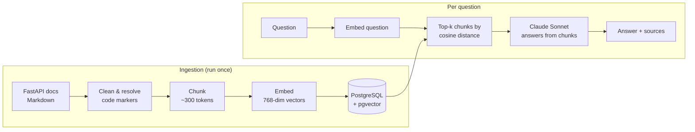

# rag-model-fastapi

A retrieval-augmented generation (RAG) system that answers questions about the FastAPI documentation. It finds the most relevant pages, then has Claude answer **only** from them, with sources. It's built from scratch, with no LangChain or other RAG frameworks.

## Demo

`POST /ask`

```json
{"question": "My frontend on another port gets blocked when calling my API, how do I allow it?"}
```

Response (shortened):

```json
{
  "answer": "You add CORS support with `CORSMiddleware`... (from `tutorial/cors.md`)",
  "file_paths": ["tutorial/cors.md", "release-notes.md"]
}
```

If the retrieved chunks don't contain the answer, the model says so instead of making something up:

```json
{"question": "What is the capital of France?"}
→ "I cannot find that information in the chunks."
```

## How it works



**Ingestion** (`scripts/ingest.py`)
1. **Load:** read every `.md` page of the FastAPI docs. Strip heading anchors and admonition markers, and replace `{* file.py *}` include markers with the actual example code, so chunks contain real code instead of a file path.
2. **Chunk:** split into sentences with NLTK and group them into chunks of about 300 tokens, with about 60 tokens of overlap between neighbours. Code blocks are protected with placeholders during splitting, so a code example is never cut in half.
3. **Embed:** encode each chunk with `all-mpnet-base-v2`, which turns each chunk into one 768-number vector.
4. **Store:** insert one row per chunk (path, index, text, vector) into Postgres. Commits happen per file, files already in the table are skipped, and a failed file is rolled back without stopping the run.

Result: **2,531 chunks from 155 pages.**

**Querying** (`POST /ask`)
1. **Retrieve:** embed the question with the same model and fetch the 5 closest chunks, using pgvector's cosine distance operator (`<=>`).
2. **Generate:** send the chunks (each labelled with its file path) and the question to Claude. The system prompt says to answer only from the chunks, cite file paths, and say so when the answer isn't there.
3. **Respond:** return a JSON object with the answer and the deduplicated list of source pages.

## Tech stack

| Part | Choice | Why |
|---|---|---|
| API | FastAPI + Pydantic | Request validation and auto-generated `/docs` |
| Vector store | PostgreSQL + pgvector (Docker) | A real database with SQL, with vector search as an extension |
| Embeddings | sentence-transformers `all-mpnet-base-v2` | Runs locally and for free; good quality for its size |
| Sentence splitting | NLTK | Chunks end at sentence boundaries, not mid-sentence |
| LLM | Claude Sonnet (Anthropic SDK) | Strong at following "answer only from context" instructions |
| Tooling | uv | Fast dependency management and lockfile |

## Evaluation

Retrieval is measured with a hand-written eval set (`evaluation/evaluation.json`): **30 beginner-style questions, each paired with the docs page that answers it.** A question counts as a hit if that page appears among the retrieved chunks.

The eval only calls retrieval, not Claude. That makes it free, fast, and repeatable after every change.

| Eval set | k = 5 | k = 8 |
|---|---|---|
| 10 questions | 8/10 | 8/10 |
| 30 questions | **27/30 (90%)** | 27/30 |

**What the misses show:** all 3 failures are broad introductory pages: `tutorial/first-steps.md`, `tutorial/body.md` and `tutorial/dependencies/index.md`. Their slots go to pages like `release-notes.md` and `bigger-applications.md`, which mention everything, often several chunks from the same page. Raising k from 5 to 8 didn't recover any of them, so the expected pages rank below 8th. That points at how chunks are embedded, not at how many are returned.

Run it:

```bash
uv run python evaluation/evaluation.py
```

## Getting started

**Requirements:** Python 3.12+, [uv](https://docs.astral.sh/uv/), Docker, and an [Anthropic API key](https://console.anthropic.com/).

```bash
# 1. Install dependencies
uv sync

# 2. Configure secrets
cp .env.example .env        # then fill in POSTGRES_PASSWORD and ANTHROPIC_API_KEY

# 3. Start Postgres + pgvector (the schema in db/schema.sql is applied on first start)
docker compose up -d

# 4. Download the FastAPI docs (sparse git clone into data/)
uv run python scripts/fetch_data.py

# 5. Chunk, embed and store the docs (safe to re-run, already ingested files are skipped)
uv run python scripts/ingest.py

# 6. Start the API
uv run fastapi dev src/rag_model_fastapi/api/endpoints.py
```

Then open <http://localhost:8000/docs>, expand `POST /ask`, click **Try it out**, and send a question.

## Project structure

```
src/rag_model_fastapi/
├── api/endpoints.py          # POST /ask: retrieve → generate → JSON
├── ingestion/loader.py       # load and clean Markdown pages
├── ingestion/chunking.py     # sentence-based chunking with overlap
├── retrieval/retrieval.py    # embed the question, fetch the closest chunks
├── generation/generation.py  # prompt Claude with chunks + question
├── database.py               # connection and SQL queries
├── embedding.py              # sentence-transformers model
└── paths.py                  # absolute project paths
scripts/                      # fetch_data.py, ingest.py (run by hand)
evaluation/                   # eval questions + eval script
db/schema.sql                 # chunks table with a vector(768) column
```

## Design decisions

- **No framework.** Every step (loading, chunking, embedding, storage, retrieval, prompting) is plain Python and SQL, so each part can be understood, measured and changed on its own.
- **Code blocks are never split.** FastAPI docs are half code; a chunk with half a code example is useless as context.
- **Generation doesn't retrieve.** `generate(question, chunks)` takes chunks as input instead of fetching them itself. That keeps steps independent, and makes it possible to evaluate retrieval alone or compare against a no-RAG baseline.
- **One connection per request**, opened by the endpoint and closed before the Claude call, so no database connection is held open while waiting for the model.
- **Relative file paths in the database** (`tutorial/cors.md`), so the data doesn't depend on where the project lives on disk.
- **Eval-driven:** changes to retrieval are judged by the eval score, not by trying a single question.

## Roadmap

- [ ] Improve retrieval on introductory pages (for example embedding prose separately from code, or keyword + vector hybrid search), measured with the eval
- [ ] Unit tests for loading, chunking and the API
- [ ] React chat frontend calling `POST /ask`
- [ ] Docker Compose for the whole stack (API + database + frontend)
