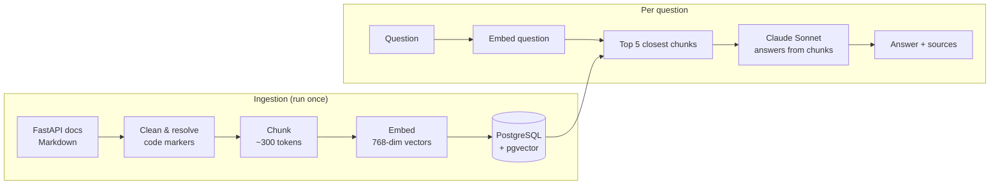

# rag-model-fastapi

A RAG system that answers questions about the FastAPI docs, built from scratch without LangChain.

You ask a question, it finds the most relevant parts of the docs, and Claude answers using only those parts, with the pages it got the answer from.

## Demo

`POST /ask`

```json
{"question": "My frontend on another port gets blocked when calling my API, how do I allow it?"}
```

What comes back (shortened):

```json
{
  "answer": "You add CORS support with `CORSMiddleware`... (from `tutorial/cors.md`)",
  "file_paths": ["tutorial/cors.md", "release-notes.md"]
}
```

If the answer isn't in the docs, it says so:

```json
{"question": "What is the capital of France?"}
→ "I cannot find that information in the chunks."
```

## How it works



**Ingestion** (I run it once, with `scripts/ingest.py`)
1. **Load:** read all the docs pages, clean them up, and put the real example code where the docs only reference a file.
2. **Chunk:** split each page into sentences and group them into chunks of about 300 tokens, with a bit of overlap. Code blocks never get cut in half.
3. **Embed:** turn every chunk into a vector of 768 numbers.
4. **Store:** save each chunk with its vector in Postgres. That ends up as 2,531 chunks from 155 pages.

**Asking a question** (`POST /ask`)
1. **Retrieve:** turn the question into a vector the same way, and get the 5 chunks closest to it.
2. **Generate:** send those chunks and the question to Claude, and tell it to answer only from the chunks and cite the files.
3. **Respond:** send back the answer and the list of pages it came from.

## Tech stack

| Part | What I used | Why |
|---|---|---|
| API | FastAPI + Pydantic | Request validation and a `/docs` page to test with |
| Database | PostgreSQL + pgvector (in Docker) | A real database that can also search by vectors |
| Embeddings | sentence-transformers `all-mpnet-base-v2` | Runs locally, free |
| Sentence splitting | NLTK | So chunks end at the end of a sentence, not in the middle |
| LLM | Claude Sonnet | Follows the "only answer from the chunks" instruction well |
| Tooling | uv | Fast package management |

## Evaluation

I wrote 30 questions the way a beginner would ask them, and for each one I wrote down which docs page has the answer. The eval script checks if that page shows up in the chunks that come back.

It only runs the retrieval part, not Claude, so it doesn't cost anything to run.

**Result: 27/30 (90%)**, the same with 5 and with 8 chunks.

The 3 it misses are all basic intro pages: `first-steps.md`, `body.md` and `dependencies/index.md`. Instead, pages like `release-notes.md` and `bigger-applications.md` keep showing up, often several chunks from the same page. Getting 8 chunks instead of 5 didn't fix any of them, so the right pages are ranked even lower than that.

Run it with:

```bash
uv run python evaluation/evaluation.py
```

## Getting started

You need Python 3.12+, [uv](https://docs.astral.sh/uv/), Docker, and an [Anthropic API key](https://console.anthropic.com/).

```bash
# 1. Install the dependencies
uv sync

# 2. Add your secrets
cp .env.example .env        # then fill in POSTGRES_PASSWORD and ANTHROPIC_API_KEY

# 3. Start Postgres (it creates the table from db/schema.sql the first time)
docker compose up -d

# 4. Download the FastAPI docs into data/
uv run python scripts/fetch_data.py

# 5. Chunk, embed and save the docs (you can re-run it, it skips files that are already in)
uv run python scripts/ingest.py

# 6. Start the API
uv run fastapi dev src/rag_model_fastapi/api/endpoints.py
```

Then open <http://localhost:8000/docs>, click on `POST /ask`, then **Try it out**, and ask something.

## What's next

- [ ] Improve retrieval for the intro pages
- [ ] Unit tests
- [ ] A React chat frontend that calls `POST /ask`
- [ ] Put the whole thing in Docker (API + database + frontend)
